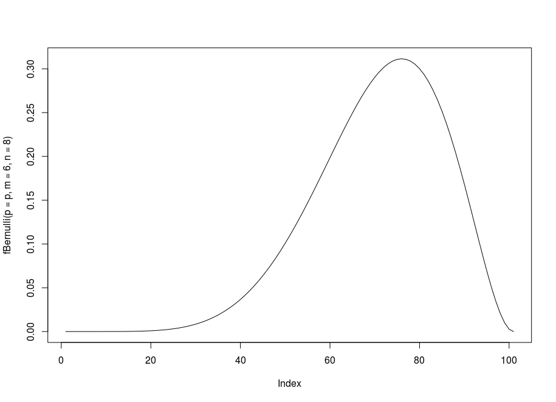

# Hit to bull's eye

### The problem
The probability of hit bull's-eye is 0.6. 
What is the probability from 8 shots there will be 6 hits bull's-eye?
### Solution
n = 8 count of tests
m = 6 count of successes
p = probability of success

So by formula Bernoulli we can find the solution

```R
source("includes/bernoulli.R")
fBernoulli(p = 0.6, m = 6, n = 8)
```
even more we can drow dependency between probability and result:
```R
p = seq(0,1,by=0.01)
plot(fBernoulli(p = p, m = 6, n = 8), type='l')
```


