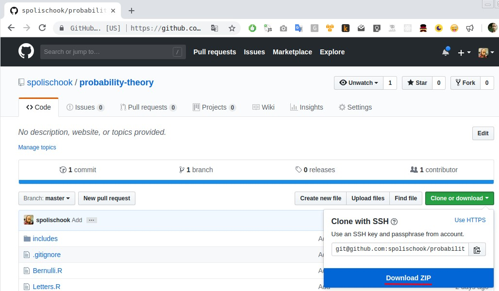

# Setup

### Install R

[Download](https://cran.r-project.org/mirrors.html) from nearest mirror package for your OS
and install it.

[Download](https://www.rstudio.com/products/rstudio/download/#download) and install **R-Studio**
for your OS

### Setup codebase

1. First of all you should get the current codebase.
 
a) The best way is by git:
```bash
git clone https://github.com/spolischook/probability-theory
```

b) But you can also download it from github as well



Set current directory and source code:
```R
setwd("path/to/codebase/directory")
source("includes/combinatorics.R")
```